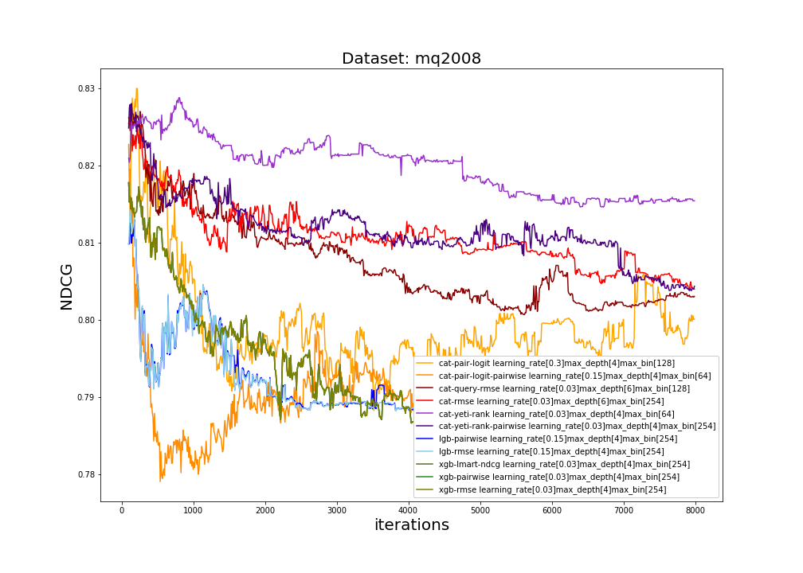
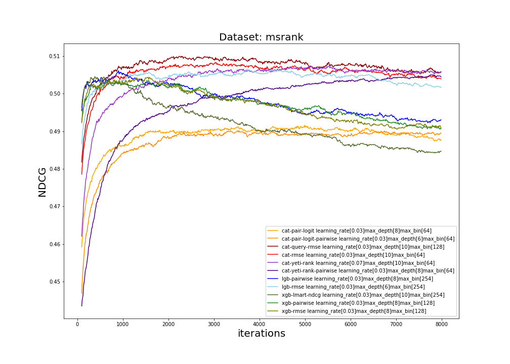
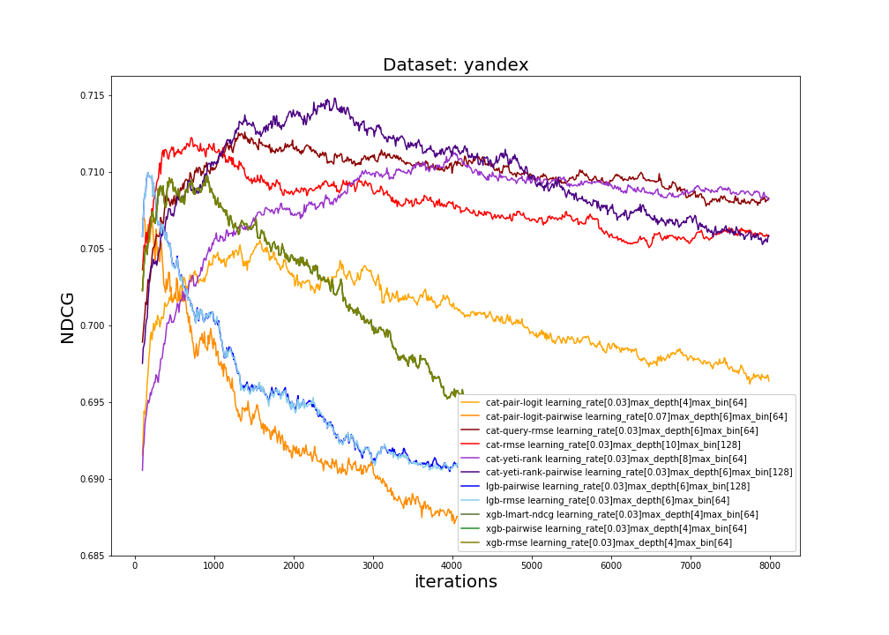

# Ranking benchmark

This is quality benchmark of learning to rank (LETOR) methods based on gradient boosted decision trees (GBDT).

## 1. Datasets

* Million queries dataset from TREC 2008, 
 [MQ2008](https://www.microsoft.com/en-us/research/project/letor-learning-rank-information-retrieval/#!letor-4-0),
 (train and test folds).
* Microsoft LETOR dataset (WEB-10K), 
 [MSLR](https://www.microsoft.com/en-us/research/project/mslr/)
 (First set, train and test folds).
* Yahoo LETOR dataset (C14), 
 [Yahoo](https://webscope.sandbox.yahoo.com/catalog.php?datatype=c&guccounter=1)
 (First set, set1.train.txt and set1.test.txt files).
* Yandex LETOR dataset, 
 [Yandex](https://github.com/spbsu-ml-community/jmll/tree/master/ml/src/test/resources/com/expleague/ml)
 (features.txt.gz and featuresTest.txt.gz files).
 
More about loading and preprocessing you can find in [preprocessing.py](./preprocess.py)

### Dataset characteristics

|              |       |        |         |                                                                |                                           | 
|--------------|-------|--------|---------|----------------------------------------------------------------|-------------------------------------------| 
| Dataset name |       | rows   | columns | y distribution                                                 | num samples in queries (min, median, max) | 
| mq2008       | train | 9630   | 46      | {0.0: 7820, 1.0: 1223, 2.0: 587}                               | (5, 8, 121)                               | 
|              | test  | 2874   | 46      | {0.0: 2319, 1.0: 378, 2.0: 177}                                | (6, 14, 119)                              | 
| msrank       | train | 723412 | 136     | {0.0: 377957, 1.0: 232569, 2.0: 95082, 3.0: 12658, 4.0: 5146}  | (1, 110, 809)                             | 
|              | test  | 241521 | 136     | {0.0: 124784, 1.0: 77896, 2.0: 32459, 3.0: 4450, 4.0: 1932}    | (1, 109, 514)                             | 
| yahoo        | train | 473134 | 699     | {1.0: 169897, 2.0: 134832, 0.0: 123294, 3.0: 36170, 4.0: 8941} | (1, 19, 139)                              | 
|              | test  | 165660 | 699     | {1.0: 59107, 2.0: 48033, 0.0: 42625, 3.0: 12804, 4.0: 3091}    | (1, 19, 129)                              | 
| yandex       | train | 12463  | 53      | {0: 6599, 2: 3311, 1: 2303, 3: 196, 4: 56}                     | (1, 15, 62)                               | 
|              | test  | 46594  | 53      | {0: 24562, 2: 12487, 1: 8658, 3: 701, 4: 188}                  | (1, 14, 63)                               | 

## 2. Algorithms

Here we compare the most popular GBDT libraries: CatBoost, XGBoost, LightGBM.

Ranking task type can be solved using different methods, e.g. the simplest one is to fit regression on labels 
taken from experts, also there are such methods as pairwise and listwise ranking. 
More information about different objectives in CatBoost you may find in 
[ranking tutorial](../../tutorials/ranking/ranking_tutorial.ipynb).

* **For CatBoost** we evaluate objectives: RMSE, QueryRMSE, PairLogit, PairLogitPairwise, YetiRank, YetiRankPairwise
* **For XGBoost**: reg:linear, xgb-lmart-ndcg, xgb-pairwise
* **For LightGBM**: lgb-rmse, lgb-pairwise

### Parameters

1. For each method we evaluate 8K iterations.
2. We search best hyper-parameters over this grid:

  |               |        |      |      |     | 
  |---------------|--------|------|------|-----| 
  | Parameter     | Values |      |      |     | 
  | learning rate | 0.03   | 0.07 | 0.15 | 0.3 | 
  | max_bin       | 64     | 128  | 254  |     | 
  | max_depth     | 4      | 6    | 8    | 10  | 

## 3. Evaluation

### Dependencies

GBDT libraries versions:

* CatBoost: 0.11.1
* XGBoost : 0.80
* LightGBM: 2.2.1

and python packages: sklearn, pandas, numpy, collections, functools.

### Metric

We compare methods by the mean [NDCG metric](https://en.wikipedia.org/wiki/Discounted_cumulative_gain).

    def ndcg(y_score, y_true, k):
        order = np.argsort(y_score)[::-1]
        y_true = np.take(y_true, order[:k])
    
        gain = 2 ** y_true - 1
    
        discounts = np.log2(np.arange(len(y_true)) + 2)
        return np.sum(gain / discounts)
        
    mean_ndcg = sum(ndcg(query) for query in queries) / len(queries)
    
Where k is the number of taken top documents for metric evaluation. In our case k=top=10.

Or in other words: DCG(query) = sum_i ((2 ** label_i - 1) / log(i + 2));
MeanDCG = sum_query DCG(query) / num_queries.

## 4. Results

|                         |               |         |           |             | 
|-------------------------|---------------|---------|-----------|-------------| 
| **MQ2008**              |               |         |           | **NDCG**    | 
|                         | learning_rate | max_bin | max_depth | best_score  | 
| **cat-rmse**            | 0.03          | 254     | 6         | **0.830443**| 
| cat-query-rmse          | 0.03          | 128     | 6         | 0.82957     | 
| cat-pair-logit          | 0.3           | 128     | 4         | 0.829991    | 
| cat-pair-logit-pairwise | 0.15          | 64      | 4         | 0.829537    | 
| cat-yeti-rank           | 0.03          | 64      | 4         | 0.828799    | 
| cat-yeti-rank-pairwise  | 0.03          | 254     | 4         | 0.828047    | 
| xgb-rmse                | 0.03          | 254     | 4         | 0.822891    | 
| xgb-pairwise            | 0.03          | 254     | 4         | 0.822891    | 
| xgb-lambdamart-ndcg     | 0.03          | 254     | 4         | 0.822891    | 
| lgb-rmse                | 0.15          | 64      | 4         | 0.822661    | 
| lgb-pairwise            | 0.15          | 64      | 4         | 0.822661    |

|                         |               |         |           |            | 
|-------------------------|---------------|---------|-----------|------------| 
| **MSRank**              |               |         |           | **NDCG**   | 
|                         | learning_rate | max_bin | max_depth | best_score | 
| cat-rmse                | 0.03          | 64      | 10        | 0.50829    | 
| **cat-query-rmse**      | 0.03          | 128     | 10        | **0.50998**| 
| cat-pair-logit          | 0.03          | 64      | 8         | 0.491601   | 
| cat-pair-logit-pairwise | 0.03          | 64      | 6         | 0.49019    | 
| cat-yeti-rank           | 0.07          | 64      | 10        | 0.507434   | 
| cat-yeti-rank-pairwise  | 0.07          | 128     | 8         | 0.506411   | 
| xgb-rmse                | --            | --      | --        | --         | 
| xgb-pairwise            | 0.03          | 128     | 8         | 0.503665   | 
| xgb-lambdamart-ndcg     | 0.03          | 254     | 10        | 0.504549   | 
| lgb-rmse                | 0.03          | 254     | 6         | 0.506417   | 
| lgb-pairwise            | 0.03          | 254     | 8         | 0.5060907  |

|                         |               |         |           |            | 
|-------------------------|---------------|---------|-----------|------------| 
| **Yahoo**               |               |         |           | **NDCG**   | 
|                         | learning_rate | max_bin | max_depth | best_score | 
| cat-rmse                | 0.03          | 254     | 10        | 0.802115   | 
| cat-query-rmse          | 0.03          | 254     | 10        | 0.802229   | 
| cat-pair-logit          | 0.03          | 64      | 10        | 0.797318   | 
| cat-pair-logit-pairwise | 0.07          | 254     | 6         | 0.790396   | 
| **cat-yeti-rank**       | 0.15          | 254     | 10        |**0.802972**| 
| cat-yeti-rank-pairwise  | --            | --      | --        | --         | 
| xgb-rmse                | 0.03          | 64      | 10        | 0.798892   | 
| xgb-pairwise            | 0.03          | 128     | 10        | 0.800048   | 
| xgb-lambdamart-ndcg     | 0.03          | 128     | 10        | 0.800048   | 
| lgb-rmse                | 0.03          | 64      | 8         | 0.8013675  | 
| lgb-pairwise            | 0.03          | 128     | 8         | 0.801347   |

|                          |               |         |           |              | 
|--------------------------|---------------|---------|-----------|--------------| 
| **Yandex**               |               |         |           | **NDCG**     | 
|                          | learning_rate | max_bin | max_depth | best_score   | 
| cat-rmse                 | 0.03          | 128     | 10        | 0.71226484   | 
| cat-query-rmse           | 0.03          | 64      | 6         | 0.71261928   | 
| cat-pair-logit           | 0.03          | 64      | 4         | 0.70557892   | 
| cat-pair-logit-pairwise  | 0.07          | 64      | 6         | 0.70702202   | 
| cat-yeti-rank            | 0.03          | 64      | 8         | 0.71139851   | 
|**cat-yeti-rank-pairwise**| 0.03          | 128     | 6         |**0.71484625**| 
| xgb-rmse                 | 0.03          | 64      | 4         | 0.70976480   | 
| xgb-pairwise             | 0.03          | 64      | 4         | 0.70976481   | 
| xgb-lambdamart-ndcg      | 0.03          | 64      | 4         | 0.70976481   | 
| lgb-rmse                 | 0.03          | 64      | 6         | 0.70998032   | 
| lgb-pairwise             | 0.03          | 128     | 6         | 0.70997884   | 

### Plots

